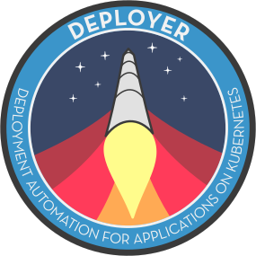

<p align="center">
  
</p>

## Architecture


## Configuration

You can find a sample config file here
[`config.sample.yml`](config.sample.yml). Sample configuration:

``` yaml
repositories:
  - name: cool_app
    github: schasse/cool_app
    kube_resource: kubernetes
```

If you use private github repositories, a private dockerhub registry
and want to secure your Deployer from unrestricted access, it is
necessary to configure secrets via environment variables. You can
configure those three secrets:

``` bash
# .env
export DEPLOYER_GITHUB_TOKEN="df16f9887f5a45980ca37af7c9a1d1100e477a0f"
export DEPLOYER_DOCKER_REGISTRY_CREDS="dockeraccount:du9oothiethah3Faelie"
export DEPLOYER_AUTH_TOKEN="6ab24b5c7e3cb7b19de93565f52208d10f58cc39"
```

You can use several different solutions to configure Deployer on
Kubernetes. In the following there are the two recommended solutions.

### Configuration via Docker image

The first solution is to build an own docker image and add the
`config.yml` to the image. See the following Dockerfile as an example.

``` dockerfile
FROM gapfish/deployer:latest
COPY .env .
COPY config.yml .
```
### Configuration via Secret and ConfigMap

Another option is to mount the configuration via a ConfigMap. Create a
Kubernetes ConfigMap like the following one:

```yaml
# kubernetes/configmap.yml
apiVersion: v1
kind: ConfigMap
metadata:
  name: deployer-config
data:
  config.yml: |
    repositories:
    - name: cool_app
      github: schasse/cool_app
      kube_resource: kubernetes
```

You'll also need to adjust the [Deployment](kubernetes/deploy.yml) to
mount the `config.yml`. See the following snippet therefor:

``` yaml
# kubernetes/deploy.yml
...
  volumeMounts:
  - name: env
    mountPath: /deployer/.env
    subPath: .env
  - name: config
    mountPath: /deployer/config.yml
    subPath: config.yml
...
volumes:
- name: config
  configMap:
  name: deployer-config
  items:
  - key: config.yml
    path: ./config.yml
- name: env
  secret:
    secretName: deployer-env
```

Then create all the resources in your Kubernetes cluster.

``` bash
kubectl create secret generic deployer-env --from-file=.env=.env
kubectl create -f kubernetes/*
```

## Deployment on Kubernetes

You can easily deploy Deployer on Kubernetes and after the initial
setup the Deployer can even deploy itself.

Have a look at the example Kubernetes resources to deploy
deployer. Therefor see [`kubernetes/`](kubernetes) folder.

## `depctl` CLI

### Installation

Docker is a prerequisite for `depctl`. If you have docker installed,
simply dowload `depctl` via:

``` shell
curl https://raw.githubusercontent.com/gapfish/deployer/master/depctl/bin/depctl | sudo tee /usr/local/bin/depctl
```

To update `depctl` run `docker pull gapfish/depctl`.

### Configuration

`depctl` must be configured by a configuration file located at
`$HOME/.deployer/deployer_env`. See the following configuration as an
example.

``` shell
# ~/.deployer/deployer_env
export DEPLOYER_AUTH_TOKEN="xxxxxxxxxxxxxxxxxxxxxxxxxxxxxxxxxxxxxxxx"
export DEPLOYER_URL="https://deployer.my-domain.com"
```

### Usage

Directly control the Deployer via `depctl` Api CLI.

``` shell
~ depctl --help

Commands:
  build                ALPHA FEATURE: Builds a repository locally and then
                       pushes to registry.
  canary [REPOSITORY]  Deploy a canary for a repository.
  deploy [REPOSITORY]  Deploy a repository.
  ls                   List available repositories.
  show [REPOSITORY]    Show the repository.
  tags [REPOSITORY]    List tags for a repository.
  ------------------------------------------------------------------------
  help [(tags|deploy|canary)] Prints help for the command.
  version                     Prints the depctl and ruby version.
```
